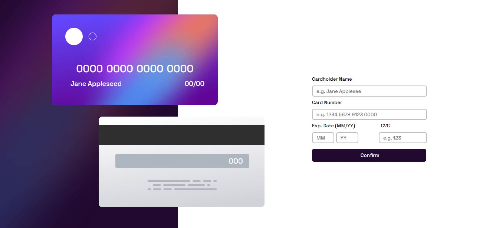

# Formulário de cartão de crédito interativo

Nesse projeto poderemos colocar os dados do catão de crédito, e visualizar como irá ficar em tempo real no cartão exemplo. Caso não seja inserido nenuhm dado a página avisa sobre itens faltantes. Campos de inserir limita caracteres e em alguns permite apenas números.

## Table of contents

- [O Projeto](#o-projeto)
  - [Screenshot](#screenshot)
  - [Links](#links)
- [Meu processo](#meu-processo)
  - [Construido com](#construido-com)
  - [O que aprendi](#o-que-aprendi)
  - [O que será feito futuramente](#o-que-será-feito-futuramente)
- [Autor](#autor)

### O Projeto

Esse projeto tem como finalidade a criação de uma página para inseir dados de cartão, e que exiba as informações digitadas em tempo real no examplo ao lado. Não é possivel confirmar sem antes ter os campos preenchidos, e o usuário é notificado caso tente enviar um formulário em branco.

### Screenshot

Abaixo temos um screenshot de como ficou meu resuldado da imagem:

### Links

Para a resoluçao desse projeto, quando necessário realizei pesquisas utilizei as seguintes fontes:

- W3 Schools: [https://www.w3schools.com/](https://www.w3schools.com/)
- Mdn: [https://developer.mozilla.org/pt-BR/](https://developer.mozilla.org/pt-BR/)
- Stackoverflow: [https://pt.stackoverflow.com/](https://pt.stackoverflow.com/)

## Meu processo

- [X] Criação da estrutura da página.
- [X] Inserir imagens e acertar os espacamentos e posições.
- [X] Criar div de formulário, espaço para colocar todos os inputs.
- [X] Iserir componentes.
- [X] Arrumar espaçamento e estilo.
- [X] Criar div de agradecimento.
- [X] Iserir componentes.
- [X] Arrumar espaçamento e estilo.
- [X] Iniciar com arquivo JS.
- [X] Criar funções .
- [X] Implementar funções.
- [ ] Implementação a responsividade.

### Construido com

- Semantic HTML5 markup
- CSS custom properties

### O que aprendi

Nesse projeto aprendi a criar um função para controlar como exibiro que está sendo digitado em um input:

function maskCard(i){
   
    var v = i.value;
    
    if(isNaN(v[v.length-1])){ 
       i.value = v.substring(0, v.length-1);
       return;
    }
    
    i.setAttribute("maxlength", "19");
    if (v.length == 4) i.value += " ";
    if (v.length == 9) i.value += " ";
    if (v.length == 14) i.value += " ";
 
 }

 E com essa função faz com que o input aceite 19 caracteres, contando com os espaços em branco para fazer o distanciamento dos números conforme o padrão do cartão.

### O que será feito futuramente

Nesse projeto futuramenteo será implementado a responsividade.

## Autor

- GitHub - [GitHub Lucas Boarini](https://github.com/BoariniLucas)
